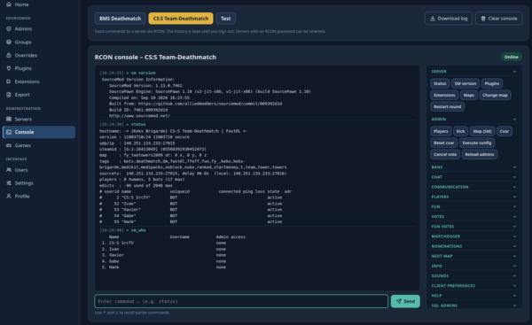
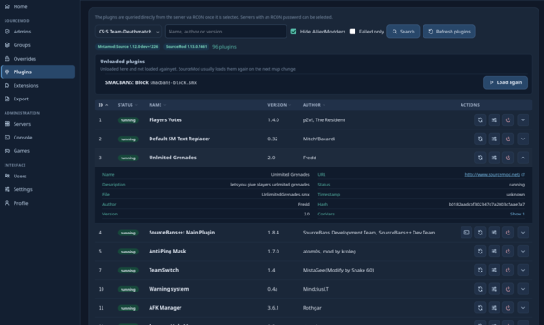
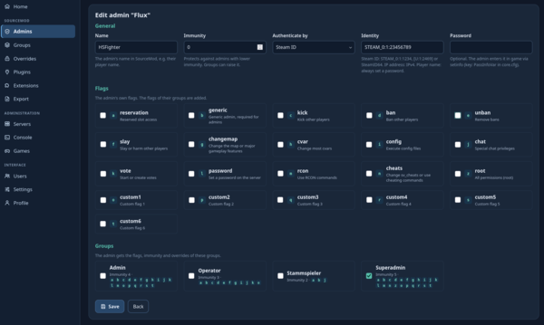

<p align="center">
  
  &nbsp;
  <picture>
    <source media="(prefers-color-scheme: dark)" srcset="assets/images/logo-smwa-plus-wordmark.png">
    
  </picture>
</p>

<h1 align="center">SourceMod Web Admin Plus 3.0.0-dev</h1>

<p align="center">
  Manage SourceMod admins, plugins and game servers from the browser.<br>
  A rebuild of the SourceMod Web Admin (SMWA, 2008–2012) for PHP 8.
</p>

---

No framework, no Composer, no build step: plain PHP 8, MariaDB/MySQL via PDO, a small template system of its own and a
single JavaScript file. Upload it, open the installer, done.

## Screenshots

<p align="center">
  <a href="docs/screenshots/console.png"></a>
  <a href="docs/screenshots/plugins.png"></a>
  <a href="docs/screenshots/admin-edit.png"></a>
  <br>
  <sub>RCON console with command buttons · Plugins of a server via RCON · Editing a SourceMod admin (click to enlarge)</sub>
</p>

## Contents

- [Screenshots](#screenshots)
- [Features](#features)
- [Requirements](#requirements)
- [Installation](#installation)
- [Updating](#updating)
- [Configuration](#configuration)
- [Console buttons: a guide](#console-buttons-a-guide)
- [Permissions](#permissions)
- [Languages and themes](#languages-and-themes)
- [Notes on SourceMod, servers and games](#notes-on-sourcemod-servers-and-games)
- [Security](#security)
- [For developers](#for-developers)
- [Credits](#credits)

## Features

### SourceMod admins

- **Admins** with name, authentication (Steam ID, IP or player name), password, immunity, flags and groups, all in one
  form. Steam IDs are accepted in every format SourceMod understands (`STEAM_0:1:1234`, `[U:1:2469]`, SteamID64).
- **Groups** with immunity, flags, "immune from" other groups, group overrides and a member list.
- **Overrides** for commands and command groups.
- **Export** of `admins.cfg`, `admin_groups.cfg`, `admin_overrides.cfg` and `admins_simple.ini`: download them, or upload
  them to all servers via FTP and run `sm_reloadadmins` right after.

### Plugins and extensions

- A server's **plugins** live via RCON, with search, filters, sortable columns and expandable details.
- A plugin's **ConVars** with their current values.
- **Reload, unload and load again** what was unloaded, plus "Refresh plugins". 
- **Extensions** with their errors, details, reload, unload and load again.
- Plugins that have [console buttons](#console-buttons-a-guide) get a shortcut that opens the console with their button
  group.

### Servers and games

- **Server list** with live status (map, players, game, OS, VAC). Each server loads on its own, so a server that does not
  answer does not hold up the page.
- **Game detection** from the game folder the server reports. The last detected game stays visible while the server is
  offline.
- **RCON and FTP access** per server, with "Test connection" (query, RCON with `sm version`, FTP login and path). The
  passwords are stored encrypted.
- **Games** with name and icon. Icons for 24 Source games are included, and you can upload your own.

### RCON console

- Send commands without reloading the page, with responses and times, earlier commands via ↑/↓ and the online status.
- History per server, downloadable as a text file.
- **Command buttons** next to the console. They come from simple JSON files: one file per group, no code change needed.
  Buttons can ask for values in a dialog, show a preview, suggest players from `status`, and appear only when the
  matching plugin is running. Your own groups for any server commands, configs or scripts work without any plugin.
  See the [guide](#console-buttons-a-guide).

### Users and interface

- **Users** with fine-grained [permissions](#permissions) and an owner account that always has every permission.
- **Profile** with e-mail, language, theme and password. Optional "Remember me" at login.
- **Six languages**: English, German, French, Turkish, Russian and Danish. Add a language by adding one file.
- **Themes** as plain CSS variable files.
- Works on phones and tablets.

### Installer, takeover and update

- **Web installer** with a system check, for a new installation or a **takeover of SMWA 2.x**: users with their
  permissions and passwords, servers, games and settings. The old installation is only read.
- **Update** of an existing installation in the browser, signed in as the owner.

## Requirements

- PHP 8.2 or newer with `pdo_mysql`, `mbstring` and `sodium`
- Optional: `gd` (uploading game icons) and `ftp` (uploading the admin files)
- MariaDB or MySQL
- Apache (the included `.htaccess` files block everything except `index.php`, `install/` and `assets/`) or a comparable
  web server with the same rules
- The SourceMod SQL admin tables (`sm_admins`, `sm_groups` …). SourceMod creates them with
  `configs/sql-init-scripts/mysql/create_admins.sql`, or on the game server with `sm_create_adm_tables`.

## Installation

Upload the files into a **new folder**, not over an old SMWA, and open it in the browser. Without `config/config.php`
you are taken to the installer. It checks the server and offers two tabs.

### New installation

Enter the database, the prefix for the interface tables (suggested: `smwa_`), where the SourceMod tables are, the site
title, the default language and the first user (the **owner**). The installer creates the tables and the owner, and
writes `config/config.php` with a new random key for the stored passwords.

### Take over SMWA 2.x

Instead of creating an owner, enter the database and table prefix of the old SMWA (`$table` in its `inc/config.php`,
usually `smwa`). The installer then takes over:

| From SMWA 2.x | Becomes |
|---|---|
| Users, e-mail, language | Users. The old **passwords keep working**. |
| User permissions | The same [permissions](#permissions) (`console` did not exist and is not granted) |
| Owner | The owner (if there are several, the one with the lowest ID; the others get every permission) |
| Servers with RCON and FTP | Servers, with the passwords encrypted |
| Mods | Games (only the ones missing from the included list) |
| Entries per page, server timeout | The same settings |

- The old SMWA is **only read** and stays unchanged; you can delete it once everything works.
- Every SMWA 2.x database version works (2 to 5).
- The old database must be on the same database server and readable by the same user.
- If the old tables are in the same database, the new tables need a different prefix (suggested: `smwa3_` next to the
  old `smwa_`). In another database, or once the old tables are gone, `smwa_` can be used.

### After installing

1. Delete the folder `install/`.
2. If `config/` was not writable, the installer showed the content of `config/config.php`; save it by hand.
3. Sign in.

If an installation fails, fix the problem and send the form again: the data is written in one transaction, so nothing
half-finished is left behind.

> **Keep `config/config.php` safe.** It contains the database password and `security.master_key`, which encrypts the
> stored RCON and FTP passwords. Back it up, never upload it anywhere public, and do not overwrite it when updating.
> Without the same key, the stored RCON and FTP passwords can no longer be decrypted and have to be entered again.

<details>
<summary>Installing without the installer</summary>

1. Copy `config/config.php.example` to `config/config.php` and fill it in. Create the `security.master_key` with
   `php -r 'echo base64_encode(random_bytes(32)), PHP_EOL;'`.
2. Import `database/schema.sql`. It uses the prefix `wa_`; replace it first if you want another one.
3. Create the owner: `php tools/create_owner.php <username> <e-mail>`

</details>

## Updating

1. Back up the database.
2. Upload the new files, **including `install/`**. Do not overwrite `config/`.
3. Open the interface. If the database is older than the files, you are taken to `install/` automatically.
4. Sign in with the **owner** account and start the update.
5. Delete `install/` again.

The update only adds and changes what the new version needs; your data stays. It can be started again if it is
interrupted. The current version is `3.0.0-dev`, database version `5` (continuing the numbering of the old SMWA).

## Configuration

`config/config.php` is written by the installer:

| Key | Meaning |
|---|---|
| `db.host`, `db.port`, `db.database`, `db.username`, `db.password` | Database connection |
| `db.prefix` | Prefix of the interface tables |
| `sourcemod.database` | Database of the SourceMod tables, empty = the same database |
| `sourcemod.prefix` | Prefix of the SourceMod tables (default `sm_`) |
| `security.master_key` | Encrypts the RCON and FTP passwords (32 bytes, base64). If it changes, those passwords have to be entered again. Can also come from the environment variable `APP_MASTER_KEY`. |
| `security.trusted_proxies` | IP addresses of a reverse proxy in front of the site, if any |
| `security.session_idle_timeout` | Seconds without activity until a session ends (default 7200) |
| `debug.enabled` | Show PHP errors in the browser. Only switch it on temporarily. |

Local deviations, e.g. a development database, go into `config/config.local.php`. It overrides `config/config.php`.

The site title, subtitle, default language, theme, entries per page and the server query timeout are set in the
interface under **Settings**.

## Console buttons: a guide

The buttons next to the RCON console come from the folder `console/`. **Every file is one group of buttons.** To add
buttons, add a file; it appears the next time the console is opened, without any code change.

- Files end in `.json` or `.jsonc`. Comments (`//` and `/* … */`) are allowed in both. With `.jsonc` your editor knows
  that comments are fine.
- **[`console/server.jsonc`](console/server.jsonc)** is the commented example with every option. It is also a working
  group ("Server") that you see in the console.
- **Groups do not need a plugin.** Any console command works: game server commands, cvars, `exec` of your configs.
  Only groups with `requires` depend on a SourceMod plugin; without it, a group appears on every server.
- The format is based on [Simple-RCON-Tool](https://github.com/JDE-Projects/Simple-RCON-Tool) (`label`, `command`,
  `confirm`, `{placeholder}`, `argmode`).

### Step 1: a group with one button

Create `console/mygroup.json`:

```json
{
    "name": "My server",
    "buttons": [
        {"label": "Status", "command": "status"}
    ]
}
```

Open the console: a group "My server" with a button "Status" appears. A click sends `status` immediately. The group has
no `requires`, so it does not ask the server for any plugin and appears on every server.

### Step 2: the group settings

This is the top of `server.jsonc`:

```jsonc
{
    // Title of the group: plain text, or per language.
    "name": {"en": "Server", "de": "Server"},

    // Optional: tooltip of the title.
    // "description": {"en": "Basic server commands", "de": "Grundlegende Serverbefehle"},

    // Optional: lower = further up (default 100, then the file name).
    "order": 10,

    // Optional: always start expanded.
    "open": true,

    "buttons": [ ... ]
}
```

Groups can be expanded and collapsed by their title. Groups without `"open": true` start collapsed, and the browser
remembers which ones you expand.

### Step 3: simple buttons

```jsonc
{
    "label": {"en": "SM version", "de": "SM-Version"},
    "command": "sm version"
},
{
    "label": "Maps",
    "command": "maps *",
    // Optional: tooltip (otherwise the command is shown).
    "description": {"en": "Lists all maps on the server", "de": "Listet alle Maps auf dem Server"}
}
```

A button needs `label` and `command`. Without placeholders and without `confirm` it sends right away.

The command itself may contain several commands separated by `;`, e.g. `"command": "mp_warmup_end;mp_restartgame 1"`.

### Step 4: buttons that ask for values

Write a placeholder in curly braces into the command. Before sending, the console opens a dialog that asks for the
value and shows a **preview** of the final command:

```jsonc
{
    "label": {"en": "Change map", "de": "Map wechseln"},
    "command": "changelevel {map}",
    "confirm": {"en": "Change the map now?", "de": "Die Map jetzt wechseln?"},
    "args": {
        "map": {
            "label": "Map",
            "placeholder": "de_dust2"
        }
    }
},
{
    "label": {"en": "Restart round", "de": "Runde neu starten"},
    "command": "mp_restartgame {seconds}",
    "confirm": {"en": "Restart the game?", "de": "Das Spiel neu starten?"},
    "args": {
        "seconds": {"label": {"en": "Seconds", "de": "Sekunden"}, "default": "1", "type": "number"}
    }
}
```

- `confirm` adds a question to the dialog. It also works on buttons without placeholders.
- `args` is optional. A placeholder without settings is asked for with its own name as the label.
- Placeholder names may contain letters, digits and `_`. The same placeholder may appear more than once in a command.

### Step 5: players, Steam IDs and IPs

For commands that target a player, `suggest` offers the players currently on the server (from `status`) in the field:

```json
{
    "label": "Kick",
    "command": "sm_kick {target} {reason}",
    "confirm": {"en": "Kick this player?", "de": "Spieler kicken?"},
    "args": {
        "target": {
            "label": {"en": "Player", "de": "Spieler"},
            "placeholder": {"en": "#userid or name", "de": "#userid oder Name"},
            "quote": true,
            "suggest": "player"
        },
        "reason": {"label": {"en": "Reason", "de": "Grund"}, "required": false}
    }
}
```

- `"suggest": "player"` suggests `#userid` with the player's name, `"steamid"` the Steam ID, `"ip"` the IP address.
- `"quote": true` puts the value in quotation marks, so names with spaces stay one argument.
- `"required": false` lets the field stay empty; it is then left out of the command.

### Step 6: show groups only where they make sense

```jsonc
"requires": ["basebans.smx", "sbpp_main.smx"],
"games": ["cstrike", "csgo"]
```

- **`requires`**: the group only appears if at least one of these plugins is running on the server (`.smx` may be
  omitted). The console checks this with a single RCON command after the page has loaded. If the server does not
  answer, all groups stay visible.
- **`games`**: the group only appears for servers with this game folder (assigned or detected game). If the game is not
  known yet, the group appears.

Groups with `requires` also put a console shortcut next to that plugin on the plugins page.

### Example: your own group without a plugin

A group for match servers with plain game commands and your own config files. It has no `requires`, only `games`, so
it appears on every CS:GO server, whatever plugins are running:

```json
{
    "name": {"en": "Match", "de": "Match"},
    "order": 20,
    "games": ["csgo"],
    "buttons": [
        {
            "label": {"en": "Load match config", "de": "Match-Config laden"},
            "command": "exec match.cfg",
            "confirm": {"en": "Load the match config now?", "de": "Die Match-Config jetzt laden?"}
        },
        {"label": {"en": "End warmup", "de": "Warmup beenden"}, "command": "mp_warmup_end"},
        {"label": {"en": "Kick bots", "de": "Bots entfernen"}, "command": "bot_kick"},
        {
            "label": {"en": "Run config", "de": "Config ausführen"},
            "command": "exec {file}",
            "args": {"file": {"label": "Config", "placeholder": "server.cfg", "options": ["server.cfg", "match.cfg", "fun.cfg"]}}
        }
    ]
}
```

### How the command is built

Taking the kick button above, with the player `#12` and an empty reason:

1. Each value is trimmed.
2. With `"argmode": "underscore"` on the button, spaces inside values become `_`.
3. With `"quote": true`, the value is put in quotation marks: `"#12"`.
4. The values replace the placeholders. Empty optional values are left out.
5. Double spaces are collapsed: the console sends `sm_kick "#12"`.

Values must not contain `;` or `"` (`;` would start a second command in the Source console). The dialog refuses them,
and the whole command may be at most 511 characters.

### Reference

**Group**

| Field | Required | Meaning |
|---|---|---|
| `name` | – | Title. Default: the file name |
| `description` | – | Tooltip of the title |
| `order` | – | Sort order, lower = further up. Default 100, then the file name |
| `open` | – | `true` = always start expanded |
| `requires` | – | Plugin file or list; show only if one of them is running |
| `games` | – | Game folder or list; show only for these games |
| `buttons` | yes | List of buttons |

**Button**

| Field | Required | Meaning |
|---|---|---|
| `label` | yes | Text on the button |
| `command` | yes | Console command, with `{placeholders}` if needed |
| `description` | – | Tooltip. Default: the command |
| `confirm` | – | Question before sending |
| `argmode` | – | `"underscore"`: replace spaces in values with `_` |
| `args` | – | Settings per placeholder (see below) |

**Placeholder (`args.<name>`)**

| Field | Default | Meaning |
|---|---|---|
| `label` | the name | Label of the field |
| `placeholder` | – | Grey example text in the empty field |
| `default` | – | Value the field starts with |
| `type` | `"text"` | `"number"` for a number field |
| `options` | – | List of suggestions to pick from |
| `quote` | `false` | Put the value in quotation marks |
| `required` | `true` | `false` = may stay empty |
| `suggest` | – | Players from `status`: `"player"` (#userid), `"steamid"` or `"ip"` |

**Texts** (`name`, `description`, `label`, `confirm`, `placeholder`) are plain text, or per language:
`{"en": "Ban", "de": "Bannen"}`. The interface language is shown, otherwise English, otherwise the first one given.

### Included groups

Groups for every AlliedModders SourceMod plugin with commands that can be used via RCON: adminhelp, basebans,
basechat, basecomm, basecommands, basetriggers, basevotes, clientprefs, funcommands, funvotes, mapchooser, nextmap,
nominations, playercommands, sounds and sql-admin-manager. Each one only appears while its plugin is running.

Also included: `spectatorswitch.json` and `kdchecker.json` for the
[Spectator Switch](https://github.com/Flux001337/Sourcemod-Spectator-Switch) and
[KDR Checker](https://github.com/Flux001337/Sourcemod-Kill-Death-Ratio-Checker) plugins.

### Troubleshooting

- **The group does not appear:** check `requires` and `games`. Is the plugin loaded (`sm plugins list`)? Does the
  server's game folder match?
- **A red notice above the console names a file:** the notice says what is wrong. If the file is not valid JSON (e.g. a
  missing comma), its whole group is skipped. If a button is missing `label` or `command`, only that button is skipped.
  All other groups keep working.
- **The dialog says a value is invalid:** the value contains `;` or `"`.

## Permissions

Permissions belong directly to a user:

| Permission | Allows | Old SMWA |
|---|---|---|
| `users` | Create, edit and delete users | UserEditUsers |
| `permissions` | Grant permissions | UserEditPermissions |
| `settings` | Interface settings | UserEditInterfacesettings |
| `sqladmins` | SourceMod admins, groups, overrides, export | UserSQLAdmins |
| `servers` | Servers with RCON and FTP access | UserServersettings |
| `games` | Games (game folders and icons) | UserEditMods |
| `plugincontrol` | The servers' SourceMod plugins and extensions | UserPlugincontrol |
| `console` | RCON console: **any** command to the servers | – |

- The **owner** always has all permissions. Nobody else can edit or delete the owner.
- Users who are not the owner can only grant or revoke permissions they have themselves, and never change their own.
- When an admin changes a user's password, that user's sessions and remembered logins end.

## Languages and themes

**Languages:** every file `lang/<code>.json` is a language and appears in the selection without any code change.
`meta.name` is its name, `meta.flag` the flag in `assets/flags/<flag>.svg`. English is the base language: missing texts
are shown in English. The console buttons are written in English and German; other languages see the English texts.

```jsonc
{ "meta": { "name": "Deutsch", "flag": "de" }, "nav": { ... }, ... }
```

The language is the user's own choice, otherwise the one picked on the login page, otherwise the site's default.

**Themes:** every CSS file in `assets/css/themes/` is a theme (file name = name) and sets all colors and sizes as CSS
variables; `assets/css/styles.css` only uses these variables. With two or more themes, users can pick one in their
profile, and the default is set under Settings.

## Notes on SourceMod, servers and games

- The interface never changes the SourceMod table structure (schema version 1409, unchanged since SourceMod 1.0); it
  only writes data. If the tables live in another database or use another prefix, set `sourcemod.*` in the config.
- Many SourceMod tables are still latin1. Text that does not fit (e.g. emojis) is rejected with a message instead of
  causing a database error.
- Group names are unique, because SourceMod assigns groups by name. The order of an admin's groups is kept.
- Uploaded game icons are saved again as PNG (at most 128 px, shown at 32 × 32) in `assets/uploads/games/`, which must
  be writable by the web server.
- Server groups will follow.

## Security

- Prepared statements everywhere, HTML escaping in the template system
- CSRF token in every form, added automatically
- Content Security Policy without inline JavaScript or inline styles
- Rate limits for login, password checks and the update login
- New session ID on login; sessions end when the password changes; single-use tokens for "Remember me"
- RCON and FTP passwords encrypted with libsodium
- Passwords taken over from SMWA 2.x (MD5) are replaced with a modern hash at the user's next login

## For developers

```text
app/        Classes: database, template, auth, permissions, settings, languages, themes, SourceMod, servers,
            installer, updater, SMWA 2.x takeover
assets/     CSS (styles.css + themes/), JavaScript, flags, icons, game icons; uploads/ for uploaded icons
config/     Configuration
console/    RCON console buttons (example: server.jsonc)
database/   Database schema
install/    Installer, takeover of SMWA 2.x and update (delete after use)
lang/       Language files
lib/        External libraries (SourceQuery)
pages/      Pages (one file per section)
templates/  layouts/, partials/, pages/, install/
tools/      Command line scripts
index.php   Entry point: session, security, routing, layout
router.php  Router for the PHP development server
```


- **SourceQuery:** `lib/SourceQuery` is the xPaw library, with one change in `SourceRcon.php` 
  (packets over 64 KiB throw an exception instead of exhausting memory).
  After updating the library, apply that change ("Keks Brigarde") again.
- PHP code comments are in German, documentation and the console examples in English.

## Credits

- Original SourceMod Web Admin (2008–2012) by HSFighter
- [xPaw/PHP-Source-Query](https://github.com/xPaw/PHP-Source-Query) for server queries and RCON (LGPL-2.1)
- Console button format based on [Simple-RCON-Tool](https://github.com/JDE-Projects/Simple-RCON-Tool)
